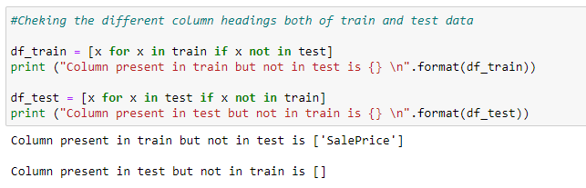
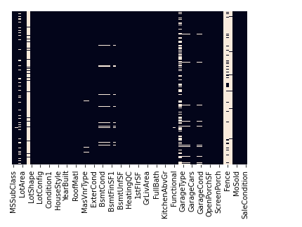
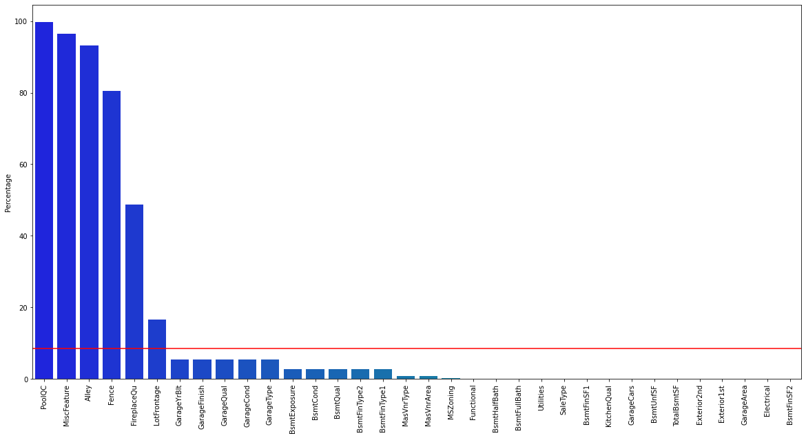
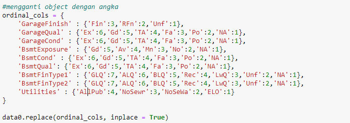
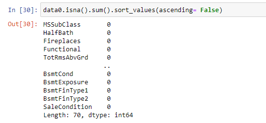
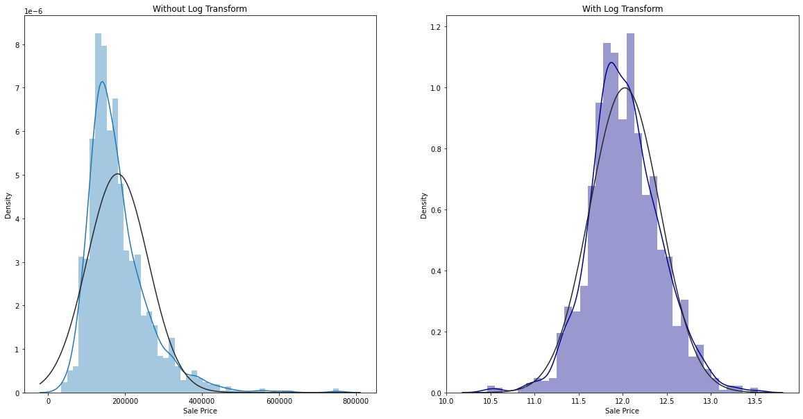
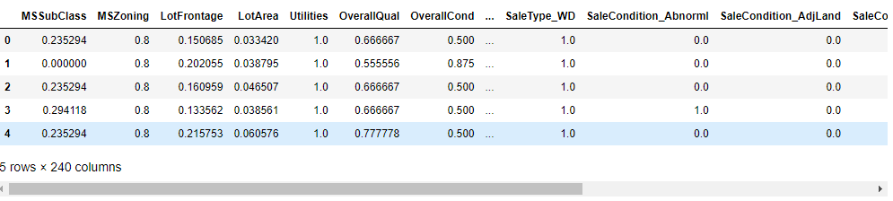
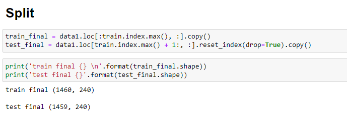
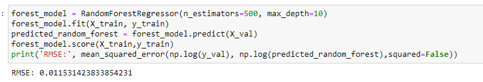
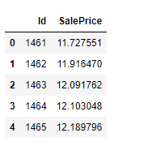

# Machine-Learning

# Predict House Price with Random Forest Regression and CSV Result

# Intent
The purpose of this notebook is to practices random forest regresion to predict house price. I will be using the data obtained from kaggle (link kaggle <a href="https://www.kaggle.com/competitions/house-prices-advanced-regression-techniques/data" target ="_blank">kaggle</a>).  
Upon completion I will have practiced combaining train and test, cleaning data, encoding categorical data, target transformation, scaling, splitting train and test dan modelling.

# Description of the Data
|No | Column |   Detail|
|---|---|---|
| 1  |SalePrice   | the property's sale price in dollars. This is the target variable that I'm trying to predict.  |
|2   | MSSubClass  | The building class  |
| 3  | MSZoning  | The general zoning classification  |
|  4 | LotFrontage  | Linear feet of street connected to property  |
| 5  | LotArea  | Lot size in square feet  |
|  6 | Street  | Type of road access  |
|  7 |  Alley | Type of alley access  |
| 8  | LotShape  | General shape of property  |
| 9  |  LandContour | Flatness of the property  |
| 10  |  Utilities | Type of utilities available  |
| 11 | LotConfig  |  Lot configuration |
|  12 | LandSlope  |  Slope of property |
|  13 |  Neighborhood |  Physical locations within Ames city limits |
| 14  | Condition1   |  Proximity to main road or railroad |
| 15 |  Condition2  | Proximity to main road or railroad (if a second is present)  |
|  16 | BldgType   | Type of dwelling  |
| 17  | HouseStyle   | Style of dwelling  |
| 18  |  OverallQual  | Overall material and finish quality  |
| 19  | OverallCond   | Overall condition rating  |
| 20 |  YearBuilt  | Original construction date  |
| 21  | YearRemodAdd  | Remodel date  |
| 22  | RoofStyle   |Type of roof   |
|  23 |RoofMatl  | Roof material   |
| 24  | Exterior1st   | Exterior covering on house  |
| 25 | Exterior2nd  | Exterior covering on house (if more than one material)   |
| 26  |  MasVnrType  | Masonry veneer type  |
| 27  | MasVnrArea   | Masonry veneer area in square feet  |
| 28  | ExterQual   | Exterior material quality  |
|29   | ExterCond   | Present condition of the material on the exterior  |
|30  |  Foundation  | Type of foundation   |
| 31  |  BsmtQual  | Height of the basement   |
| 32  | BsmtCond   | General condition of the basement  |
|33   | BsmtExposure   | Walkout or garden level basement walls  |
| 34 |  BsmtFinType1  | Quality of basement finished area  |
|  35 | BsmtFinSF1   | Type 1 finished square feet  |
| 36 | BsmtFinType2   | Quality of second finished area (if present)  |
| 37  | BsmtFinSF2 | Type 2 finished square feet  |
| 38  | BsmtUnfSF  | Unfinished square feet of basement area  |
| 39 | TotalBsmtSF  | Total square feet of basement area  |
| 40  | Heating  | Type of heating  |
| 41  | HeatingQC  | Heating quality and condition  |
|  42 |CentralAir  | Central air conditioning  |
| 43 |  Electrical  | Electrical system  |
| 44 |1stFlrSF  | First Floor square feet  |
| 45  | 2ndFlrSF   | Second floor square feet  |
| 46  |LowQualFinSF  |Low quality finished square feet (all floors)   |
| 47  | GrLivArea  | Above grade (ground) living area square feet  |
|48  | BsmtFullBath  | Basement full bathrooms  |
|49  | BsmtHalfBath  | Basement half bathrooms  |
| 50  | FullBath  | Full bathrooms above grade   |
| 51  | HalfBath  | Half baths above grade  |
|52  |Bedroom  | Number of bedrooms above basement level  |
|53  |Kitchen   | Number of kitchens  |
|54  | KitchenQual  | Kitchen quality  |
| 55  |TotRmsAbvGrd   | Total rooms above grade (does not include bathrooms)  |
| 56  | Functional  | Home functionality rating  |
|57  | Fireplaces | Number of fireplaces  |
|58  |FireplaceQu  | Fireplace quality   |
|59  | GarageType  | Garage location  |
| 60  | GarageYrBlt  | Year garage was built  |
| 61  | GarageFinish  | Interior finish of the garage  |
|62  |GarageCars | Size of garage in car capacity   |
|63  | GarageArea  | Size of garage in square feet  |
|64  | GarageQual | Garage quality   |
| 65  | GarageCond  |  Garage condition |
| 66  | PavedDrive | Paved driveway   |
|67 |WoodDeckSF  | Wood deck area in square feet  |
|68  | OpenPorchSF  | Open porch area in square feet  |
|69  | EnclosedPorch  |Enclosed porch area in square feet   |
| 70  | 3SsnPorch  | Three season porch area in square feet  |
| 71  | ScreenPorch  | Screen porch area in square feet  |
|72  |PoolArea  | Pool area in square feet   |
|73  | PoolQC  | Pool quality  |
|74  | Fence  | Fence quality  |
|75  |MiscFeature   | Miscellaneous feature not covered in other categories  |
|76  | MiscVal  | $Value of miscellaneous feature   |
|77  | MoSold | Month Sold  |
|78  | YrSold |  Year Sold  |
|79  |SaleType  | Type of sale   |
|80  |  SaleCondition |  Condition of sale   |

# Import the Dataset dan Preview

This data has been obtainer from the link below

<a href="https://www.kaggle.com/code/zainhana/predict-house-price/notebook" target= "_blank">https://www.kaggle.com/code/zainhana/predict-house-price/notebook</a>  
Train shape : (1460, 81) 
Test shape : (1459, 80)  

 

# Combaining Test and Train
 
after combaining test and train, I have 2919 rows and 79 columns

# Cleaning Data
* Cheking Null Values
 

Details of the columns with the highest to lowest null values are displayed according to the graph below.  
 

Drop column that has:
- Alot of null values will not be affect to our model
- is compined from other columns 

The dropped columns are 'Alley','PoolQC','Fence','MiscFeature','FireplaceQu with the percentage of 5 columns with the highest null value. 
If we see, Total BsmtSF is total from 3 other columns ('BsmtFinSF1','BsmtFinSF2','BsmtUnfSF'). So i will drop all of them.

# Label Encoding
For ordinal columns, I change to number with this code:
 

For empty data in the numeric column, it is filled using mode.
For empty data in the categorical column, it is filled with 'none'.

Finally the data ready to next step
 

# Target Transformation
log transform makes target result more accurate. Comparison of sale prices before and after the log transform process 

# Scaling
Before the scaling process starts, the data is created to get dummies first.
Scaling made the data have range 0-1

# Splitting train and test

# Modelling

and it's the final result 

Code details can be checked at the following link <a href="https://www.kaggle.com/code/zainhana/predict-house-price" target="_blank">kaggle</a>

